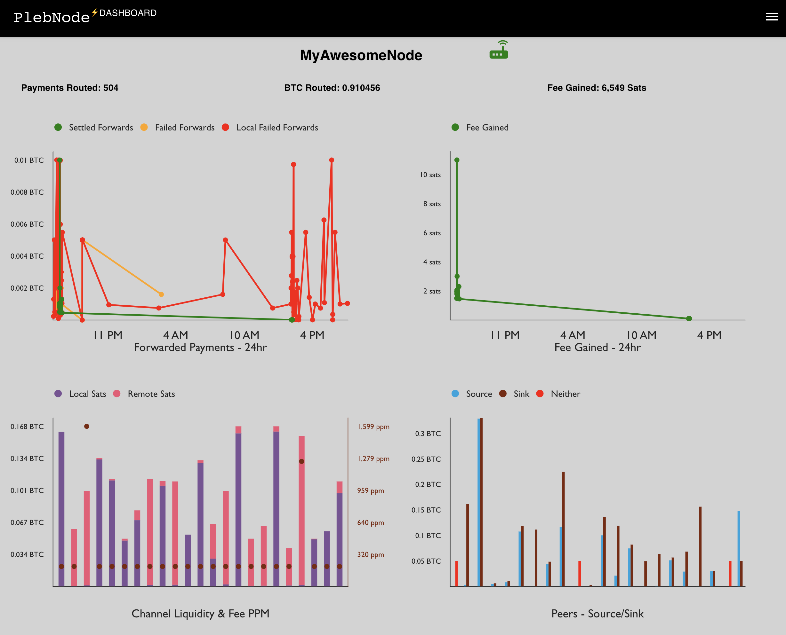

## Plebnode Dashboard - Your Lightning Node Dashboard

Plebnode Dashboad is a `LIVE` dashboard for your lightning node. It only supports core lightning node as of now. 

It connects to core lightning node's websocket port which can be set by adding experimental-websocket-port entry to ~/.lightning/config file/ For example, `experimental-websocket-port=9999` to expose port 9999 as websocket port.

 The dashboard runs the readonly commands on the node by using readonly runes. If the rune has any additional access then it will be rejected. The rune is stored in your browser local storage. 
 
 You can create readonly rune by running this command: `lightning-cli commando-rune restrictions=readonly`

## Automatic deployment
The master branch from this repository has a CI (continuous integration) build enabled which deploys any new merges automatically to [http://my.plebnode.com](http://my.plebnode.com) 

You can see your live node dashboard at the above site. 

## local build
If would like to run the dashboard locally or would like to contribute to the code, please see the build instructions below:

In the project directory, you can run:
### `npm install` 
Installs all the dependencies

### `npm start`
Runs the app in the development mode.

Open [http://localhost:3000](http://localhost:3000) to view it in your browser.

The page will reload when you make changes.\
You may also see any lint errors in the console.

### `npm test`

Launches the test runner in the interactive watch mode.

### vulnerability check
Check vulnerability status [here](https://snyk.io/test/github/plebworks/plebnode-dashboard)

## Credits
The dashboard is build upon the awesome work done by the [core lightning devs](https://github.com/ElementsProject/lightning/graphs/contributors) and [lnsocket](https://github.com/jb55/lnsocket) 

