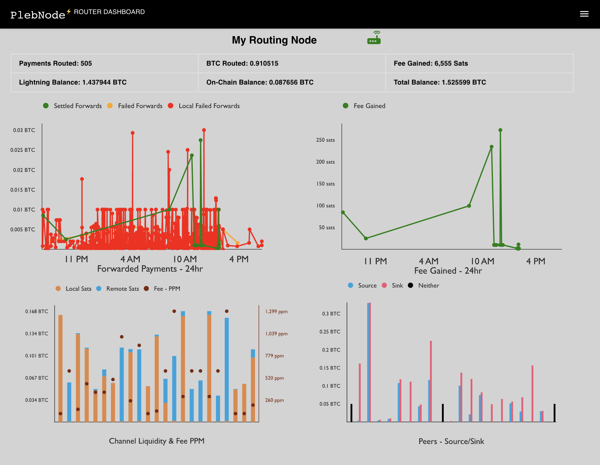

## Plebnode Dashboard - Core Lightning Router Dashboard

Plebnode Dashboad is a `LIVE` routing dashboard for your Core Lightning node. You can run it to monitor `Forwards - Settled/Failed/Local Failed, Fee Gained, Channel Liquidity (local sats/remote sats) & Fee PPM`. You can also monitor which peers are `Sinks/Sources`. The dashboard `auto refreshes` itself so you can let it run on a computer screen to monitor your node status throughout the day. 



It connects to core lightning node's websocket port which can be set by adding experimental-websocket-port entry to ~/.lightning/config file/ For example, `experimental-websocket-port=9999` to expose port 9999 as websocket port.

 The dashboard runs the readonly commands on the node by using readonly runes. If the rune has any additional access then it will be rejected. The rune is stored in your browser local storage. 
 
 You can create readonly rune by running this command: `lightning-cli commando-rune restrictions=readonly`


## local build
If would like to run the dashboard locally or would like to contribute to the code, please see the build instructions below:

1. Install Node.js from its website [https://nodejs.org](https://nodejs.org/) website, if not already insalled

2. In the project directory, run the below command to install the dependencies:
    ### `npm install` 

3. Run the below command to build and run the dashboard:
    ### `npm start`

4. Open [http://localhost:3000](http://localhost:3000) to view it in your browser.

The page will reload when you make changes.\
You may also see any lint errors in the console.

## Vulnerability check


[](https://snyk.io/test/github/plebworks/plebnode-dashboard)

Check vulnerability details [here](https://snyk.io/test/github/plebworks/plebnode-dashboard)

```diff
- WARNING: FIX vulnerabilities BEFORE using the code. If you don't know how to fix them then DON'T use the code. This code is not actively maintained. Always scan open source code for vulnerabilities before using.
```

## Credits
The dashboard is build upon the awesome work done by the [core lightning devs](https://github.com/ElementsProject/lightning/graphs/contributors) and [lnsocket](https://github.com/jb55/lnsocket) 

